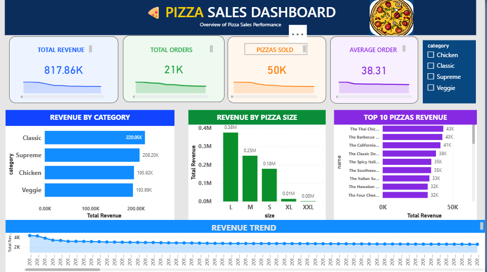

# 🍕 Pizza Sales Analysis USING SQL & POWER BI

## Project Overview

This project analyzes pizza sales data using SQL and Power BI to uncover business insights and sales trends. SQL was used to answer key business questions, while Power BI was used to create an interactive dashboard for visualizing performance metrics.

## Tools & Technologies

- SQL
- Power BI
- DAX
- GitHub

## Business Questions

The complete list of business questions is available in the `Questions.txt` file.

## Dashboard Preview

## Key Performance Indicators (KPIs)

- Generated **$817.86K** in total revenue.
- Processed **21K+ customer orders**.
- Sold **50K+ pizzas**.
- Achieved an **average order value of $38.31**.

##  Dashboard Features

- KPI Cards
- Revenue by Category
- Revenue by Pizza Size
- Top 10 Pizzas by Revenue
- Revenue Trend Analysis
- Interactive Filters

##  Key Insights

- Classic pizzas generated the highest revenue.
- Large-sized pizzas contributed the most revenue.
- More than 50K pizzas were sold during the analyzed period.
- Revenue exceeded $817K from over 21K orders.

##  Skills Demonstrated

Through this project, I developed and applied skills in:

- SQL for data extraction, transformation, and analysis
- Exploratory Data Analysis (EDA) to identify patterns and trends
- DAX for creating business KPIs and custom measures
- Power BI dashboard development and interactive reporting

##  Conclusion

This project demonstrates the complete analytics workflow, from SQL-based analysis to interactive Power BI dashboard development, helping transform raw sales data into actionable business insights.
